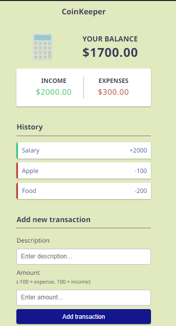

# CoinKeeper Expense Tracker

CoinKeeper is a simple expense tracker designed to help you manage your finances effectively.

## Features

- **Balance Display:** Easily view your current balance at a glance.
- **Income and Expense Tracking:** Keep track of both your income and expenses separately.
- **Transaction History:** See a history of all your transactions.
- **Add New Transactions:** Quickly add new transactions with a description and amount.
- **Responsive Design:** Works seamlessly on both desktop and mobile devices.

## Getting Started

1. **Clone the repository:**

2. **Navigate to the project directory:**

3. **Open `index.html` in your web browser to start using the expense tracker.**

## How to Use

1. **View Balance:** Your current balance is displayed at the top of the page.
2. **Income and Expenses:** The income and expenses sections show your total income and expenses.
3. **Transaction History:** View a list of all your transactions below the income and expenses sections.
4. **Add New Transaction:** Use the form at the bottom of the page to add a new transaction. Enter a description and the amount, then click "Add Transaction".
5. **Delete Transaction:** To delete a transaction, hover over it in the transaction history and click the delete button (trash icon).

## Technologies Used

- HTML
- CSS
- JavaScript

## Preview

## License

This project is licensed under the MIT License - see the [LICENSE](LICENSE) file for details.
